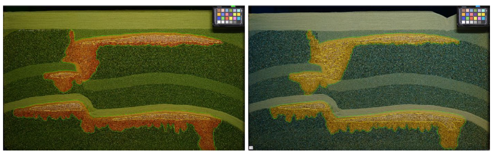
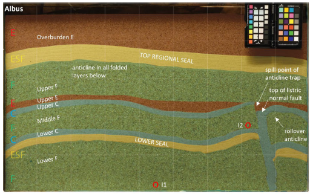
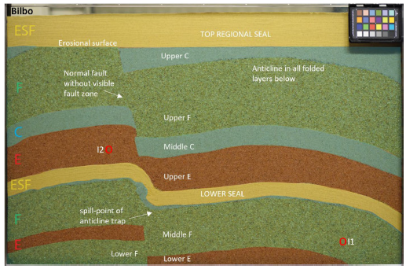

## ML4GCS Project 1 -- Transfer learning between FluidFlower rigs

*The main task of this benchmark is to "assess and probe limits of how
effectively machine‑learning models can transfer knowledge between
related geological CO₂ storage systems."*

**Context.** Each subsurface reservoir is unique in its geological
details, yet the governing physical processes remain fundamentally the
same. This motivates a central question in data‑driven subsurface
modeling: *to what extent can information learned from one site be
transferred to improve predictions at another?*

In the context of geological CO₂ storage, this question is particularly
important. Reliable forecasting is needed not only during injection
operations, but also over long post‑injection time horizons to assess
storage security. However, field‑scale data are typically sparse,
heterogeneous, and available only over limited periods of a project's
lifecycle. This raises the challenge of how to leverage existing, more
complete data sources to enhance prediction quality for newly developing
or partially observed storage sites.

To study this problem in a controlled and reproducible manner, the
benchmark moves from the field scale to the laboratory scale. We
consider two closely related laboratory experiments that serve as
proxies for two subsurface storage sites, denoted field A and field B.

**Experimental setup and analogy to field operations.** Field A is
represented by a laboratory experiment for which a comprehensive dataset
is available, covering the full lifecycle of a CO₂ injection scenario
(from injection, through plume migration, to a hypothetical long‑term
monitoring period long after injection). This dataset mimics a mature
storage site with extensive historical observations. Field B is
represented by a second laboratory experiment of the same overall
character, but with a slightly modified geometry. In this case, only
limited historical data are available, corresponding to early project
stages such as pre‑injection, injection, and a short post‑injection
period. This setup reflects a developing storage site where long‑term
behavior must be forecast with incomplete information.

**Data.** Both experiments are based on the FluidFlower concept (Fernø
et al., 2025) and consist of meter‑scale geometries under controlled,
room‑temperature conditions. The systems model CO₂ storage in
sand‑layered porous media, cf. Fig 1.

Fig 1. Repeated CO2 storage experiments in 1m scale FluidFlower rigs
using the same protocol (yet using different pH indicators for
visualization).

We consider two geometries, cf. Fig 2. While the experiments differ
primarily in the composition and configuration of sand layers, they are
governed by the same physical laws, material properties, and boundary
conditions. This ensures that differences in system response arise
mainly from geological variability rather than changes in underlying
physics. Repeated runs of both experiments are provided, introducing
measurement variability (cf. Fig 1) analogous to uncertainties
encountered in real field data. The respective data has been collected
in context with previous study on physical variability (Haugen et al.,
2024).

Fig 1. Two FluidFlower geometries with same sand types for laboratory
CO2 storage.

**Machine‑learning formulation.** Within this setting, the benchmark
investigates whether and how knowledge gained from field A can be
exploited to improve predictions for field B. In machine‑learning terms,
this corresponds to pre‑training a computational surrogate model on the
complete dataset from field A, followed by post‑training using partial
data from field B. The reformulated research question is therefore: Does
access to a fully observed reference system enable more accurate and
physically consistent forecasting for a related, but only partially
observed, target system? By framing the problem in this way, the
benchmark explicitly targets transfer learning and domain adaptation
under shared physics but differing geometries, a scenario that is highly
relevant for real‑world deployment of machine‑learning models in
geological CO₂ storage and other subsurface energy applications.

To accommodate differing levels of difficulty and uncertainty, the
benchmark is organized as a cascade of tasks with increasing complexity
and correspondingly reduced expectations of predictive performance,
ranging from relatively well‑posed to highly uncertain scenarios:

1.  **In‑distribution surrogate modeling.** Given complete data from
    field B, train a surrogate model for field B. This task serves as a
    baseline and assesses the achievable performance when sufficient,
    system‑specific data are available.

2.  **Transfer learning with partial observations.** Given complete data
    from field A for pre‑training, and historical data from field B
    available only up to specified points in time (e.g. end of injection
    or early post‑injection), train a surrogate model for field B
    capable of forecasting its subsequent evolution.

3.  **Geometry‑informed transfer learning.** Given complete data from
    field A for pre‑training and only geometrical information for field
    B, train a surrogate model for field B that accurately reproduces
    the injection‑phase dynamics. This task represents an extreme
    data‑scarce setting and probes the limits of transferability under
    shared physics.

**Metric for comparison.** We compare data based on the Wasserstein
distance of CO2 mass over time (dense data comparison) (Both et al.,
2024, Nordbotten et al. 2024), as well as integrated CO2 mass in
different sand layers (in particular sealing layer), physical
consistency as total CO2 mass, positivity of phase saturations.

**References**

Both, J. W., et al. (2024). High-fidelity experimental model
verification for flow in fractured porous media. *InterPore
Journal*, *1*(3), IPJ271124-6.

Fernø, M. A., et al. \"Room-scale CO2 injections in a physical reservoir
model with faults.\" *Transport in Porous Media* 151.5 (2024): 913-937.

Haugen, Malin, et al. \"Physical variability in meter-scale laboratory
CO2 injections in faulted geometries.\" *Transport in Porous
Media* 151.5 (2024): 1169-1197.

Nordbotten, Jan Martin, et al. \"DarSIA: An open-source Python toolbox
for two-scale image processing of dynamics in porous media.\" *Transport
in Porous Media* 151.5 (2024): 939-973.
