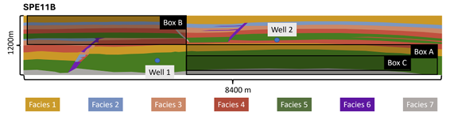
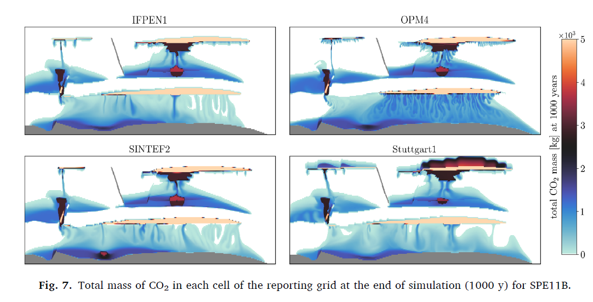
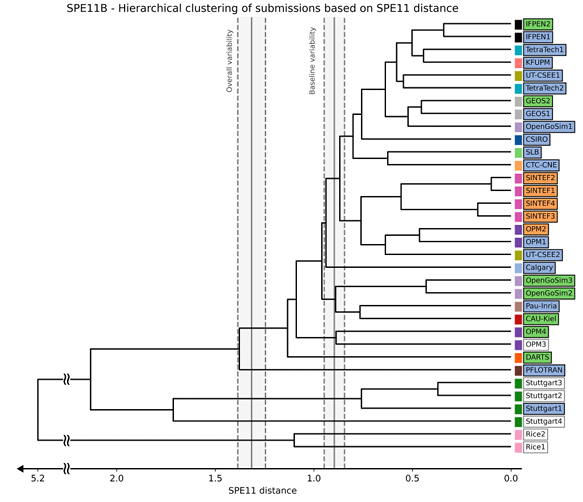

## ML4GCS Project 2 -- History matching SPE11B data

*The main task of this benchmark is to: "Provide a surrogate model that
is history-matching SPE11B data and able to forecast short- and
long-term future."*

**Context.** History matching is a central tool in subsurface field
operations, supporting both short‑ and long‑term forecasting. In the
short term, it assists decision‑making during the operational phase,
while in geological CO₂ storage it is particularly important for
assessing long‑term storage behavior and security. By conditioning
models on historical monitoring data, typically obtained from sources
such as seismic surveys, history matching enables model calibration and
improves the reliability of future forecasts. These forecasts span both
operational and post‑operational phases (with increasing uncertainty as
predictions extend further beyond the observation window), in contrast
to purely data‑agnostic physics‑based models.

**Data.** The recent comparative solution project SPE11 (Nordbotten et
al., 2024) provides a fixed and well‑defined synthetic benchmark for
geological CO₂ storage. We focus on benchmark case SPE11B, a
two‑dimensional, non‑isothermal subsurface conditions, cf. Fig 3. The
setup specifies geology, petrophysical properties, injection schedules,
and governing physics in the form of well‑posed partial differential
equations. This controlled configuration establishes a consistent
reference framework for evaluating history‑matching and
surrogate‑modeling approaches.

Fig 3. Geometry of SPE11B.

While the simulation outputs are synthetic, multiple realizations are
provided for this benchmark and can be interpreted as representing
uncertainty in repeated measurements. The benchmark has attracted a
large number of submissions (34 for the two‑dimensional subsurface case)
resulting in a rich database of multivariate simulation outputs
available as temporal snapshots of key state variables, including
pressure, saturation, and CO₂ mass etc. This ensemble of solutions
constitutes the data provided for the benchmark; notably, no definitive
ground truth is assumed to exist, cf. Fig 4.

Fig 4. Four of 34 simulation dense data outputs: CO2 mass after 1000
years.

The main objective of this benchmark is to develop surrogate models that
are capable of history matching SPE11B data and forecasting system
behavior over both short‑ and long‑term horizons.

To accommodate increasing levels of difficulty and uncertainty, the
benchmark is structured as a cascade of tasks with ascending complexity
and correspondingly reduced expectations of predictive performance,
progressing from well‑posed to highly uncertain scenarios:

1.  **In‑distribution surrogate modeling.** Given access to the full
    dataset, can a surrogate model be trained that performs well within
    the distribution of the available data?

2.  **Forecasting beyond the observation window.** Given data from the
    injection period only, can a surrogate model produce accurate and
    physically consistent predictions during the post‑injection phase?

3.  **Data efficiency for long‑term forecasting.** How much
    post‑injection data is required to train a surrogate model that
    performs robustly over long‑term storage timescales?

**[Metric for comparison.]{.underline}** Evaluation of submitted
surrogate models will leverage the existing SPE11 benchmark analysis
framework (Nordbotten et al., 2025). In the absence of ground truth,
machine‑learning results are assessed in relation to the ensemble of
available simulation outputs using the established SPE11 metric. This
metric combines dense and sparse comparisons, including, for example, L²
distances between spatial pressure fields and Wasserstein distances
between spatial CO₂ mass distributions (dense metrics), as well as
integrated CO₂ mass within selected geological units such as sealing
layers (sparse metrics).

To contextualize performance across submissions, results are
additionally analyzed using hierarchical clustering, allowing
machine‑learning surrogates to be placed within the broader spectrum of
physical simulation outcomes, cf. Fig 5.

Fig 5. Hierarchical clustering of 34 submissions.

**References**

Landa-Marbán, David, et al. \"Performance of an Open-Source Image-Based
History Matching Framework for CO 2 Storage: D. Landa-Marbán et
al.\" *Transport in Porous Media* 153.2 (2026): 21.

Nordbotten, Jan M., et al. \"The 11th Society of Petroleum Engineers
Comparative Solution Project: Problem Definition.\" *SPE Journal* 29.05
(2024): 2507-2524.

Nordbotten, Jan M., et al. \"Benchmarking CO₂ storage simulations:
Results from the 11th Society of Petroleum Engineers Comparative
Solution Project.\" *International Journal of Greenhouse Gas
Control* 148 (2025): 104519.
